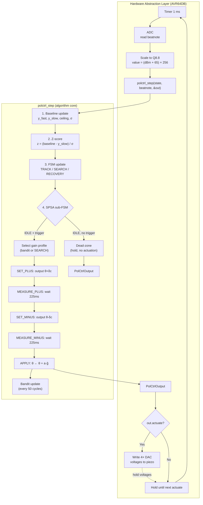
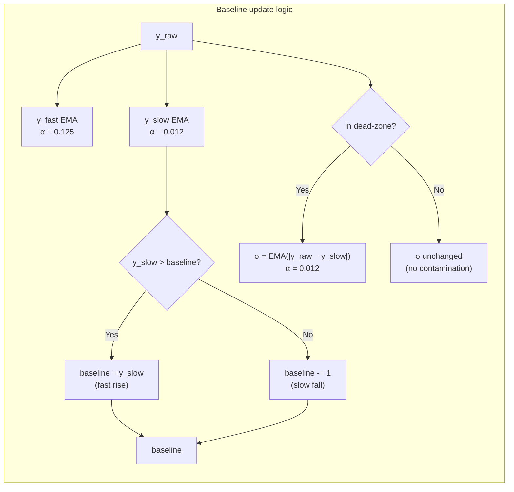
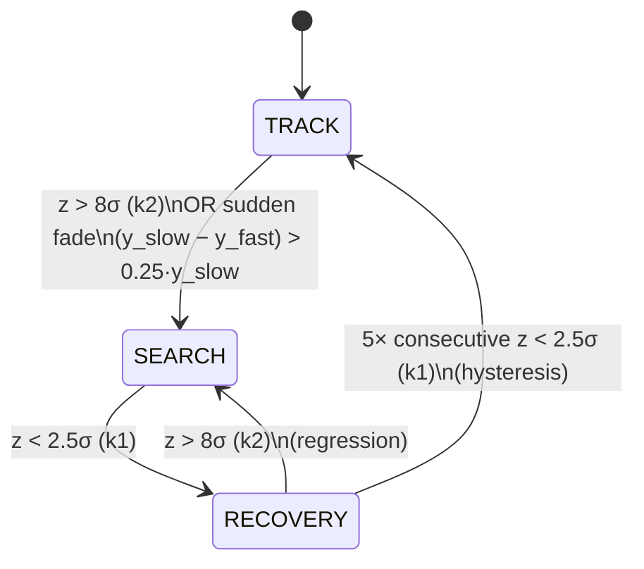
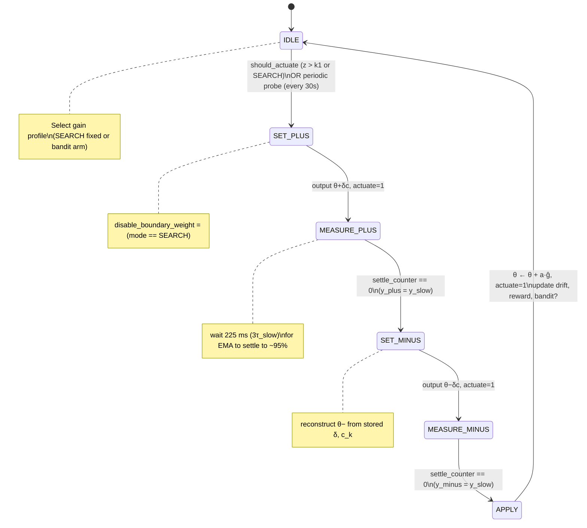
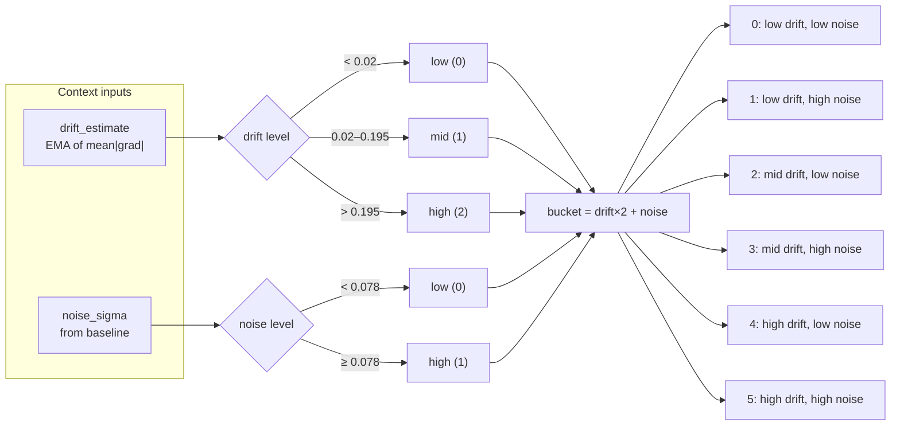
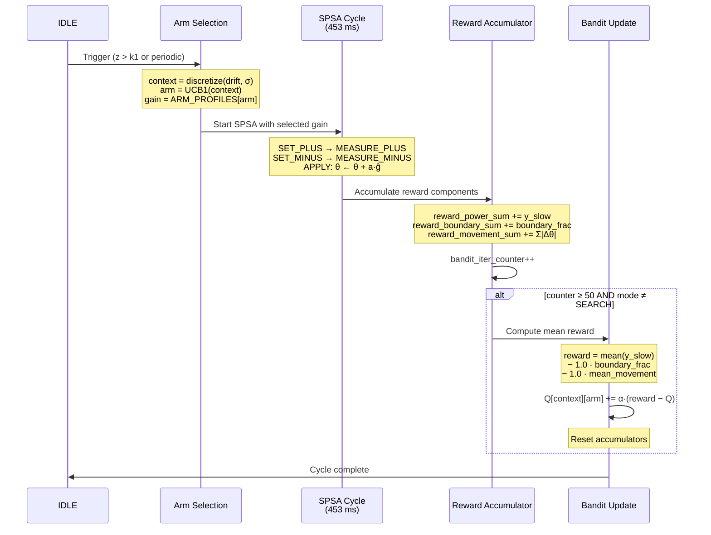
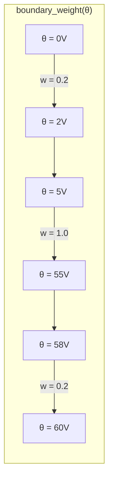

# PolCtrl — Algorithm Description

> **Language:** English
> **Audience:** Engineers implementing, reviewing, or integrating the polarization controller.
> **Scope:** Full algorithm description with diagrams, formulas, and constant tables.

---

## Table of Contents

1. [Overview](#1-overview)
2. [Data Flow: ADC → polctrl_step → DAC](#2-data-flow-adc--polctrl_step--dac)
3. [Fixed-Point Arithmetic (Q8.8)](#3-fixed-point-arithmetic-q88)
4. [Adaptive Baseline & Sigma](#4-adaptive-baseline--sigma)
5. [FSM: TRACK / SEARCH / RECOVERY](#5-fsm-track--search--recovery)
6. [SPSA Optimizer](#6-spsa-optimizer)
7. [SPSA Sub-State Machine](#7-spsa-sub-state-machine)
8. [Contextual Bandit (UCB1)](#8-contextual-bandit-ucb1)
9. [Bandit Integration with SPSA](#9-bandit-integration-with-spsa)
10. [Boundary Weighting](#10-boundary-weighting)
11. [Physical Simulator](#11-physical-simulator)
12. [Constants Reference](#12-constants-reference)

---

## 1. Overview

PolCtrl is a real-time (1 ms cadence) polarization controller for a 4-section
piezoelectric fiber squeezer in a fiber-optic frequency-transfer link. The
algorithm maximizes the "beat note" optical power (the heterodyne beat between
a local laser and the incoming signal) by adjusting 4 voltages (0–60 V, 0.1 V
grid).

It runs on a fixed-point (Q8.8, `int16_t`) MCU core with **no FPU** and **no
heap allocation**, targeting an AVR64DB-class device.

The algorithm fuses four cooperating techniques:

| Technique | Role |
|-----------|------|
| **Adaptive baseline + sigma** | Tracks the achievable power ceiling and noise floor without hardcoded dBm thresholds |
| **FSM (TRACK/SEARCH/RECOVERY)** | Dead-zone gating with hysteresis and sudden-fade detection |
| **SPSA** | Gradient-free stochastic optimizer: estimates a 4-D gradient with only 2 power measurements |
| **Contextual bandit (UCB1)** | Adaptively selects SPSA gain profiles based on drift/noise context |

---

## 2. Data Flow: ADC → polctrl_step → DAC

The HAL calls `polctrl_init` once at startup, then `polctrl_step` every 1 ms.
The HAL implements **no decision logic** — only timer → ADC → `polctrl_step`
→ DAC-if-actuate.



### Input scaling

```
beatnote_reading = (fp_t)((dBm + 65.0) × 256)
```

| dBm | Q8.8 value |
|-----|------------|
| -65 | 0 |
| -50 | 3840 |
| -38 (default ceiling) | 6912 |
| -35 | 7680 |

### Output scaling

```
voltage_volts = voltages[i] / 256.0
```

Voltages are in Q8.8 volts (0–15360), snapped to 0.1 V grid (step = 26).

---

## 3. Fixed-Point Arithmetic (Q8.8)

All arithmetic in the algorithm core uses Q8.8 fixed-point on `int16_t`.

| Property | Value |
|----------|-------|
| Type | `int16_t` (`fp_t`) |
| Format | Q8.8 (8-bit signed integer, 8-bit fractional) |
| Range | −128.0 to +127.996 |
| Resolution | 1/256 ≈ 0.0039 |
| `FP_ONE` | 256 |
| `FP_MAX` | 32767 |
| `FP_MIN` | −32768 |

### Operations

| Operation | Formula | Rounding |
|-----------|---------|----------|
| `fp_mul(a, b)` | `(int32_t)a × b >> 8` | Arithmetic right-shift (toward −∞) |
| `fp_div(a, b)` | `(a << 8) / b` | C integer division (toward 0) |
| `fp_div(a, 0)` | — | Saturating: `FP_MAX` if a>0, `FP_MIN` if a<0, 0 if a=0 |
| `fp_clamp(x, lo, hi)` | `max(lo, min(x, hi))` | — |
| `fp_abs(x)` | `|x|` (guards `FP_MIN` → `FP_MAX`) | — |

All multiplication and division use `int32_t` intermediates to prevent
overflow, then clamp back to `int16_t`.

### RNG (xorshift32)

```
x ^= x << 13
x ^= x >> 17
x ^= x << 5
```

Period: 2³² − 1. Seed 0 is remapped to 1. `rng_sign()` returns +1 if the low
bit of the next draw is 1, else −1. Identical implementation in C and Python
(bit-exact parity verified by tests).

---

## 4. Adaptive Baseline & Sigma

**Module:** `baseline.c`
**Purpose:** Track the achievable power ceiling and measurement noise without
hardcoded dBm thresholds.

### Data structure

```c
typedef struct {
    fp_t baseline;       // estimated achievable ceiling
    fp_t noise_sigma;    // estimated noise std dev
    fp_t y_fast;         // fast EMA (τ = 8 ms)
    fp_t y_slow;         // slow EMA (τ = 75 ms)
    uint8_t initialized; // 0 during cold-start, 1 after warmup
    uint16_t warmup_counter;
} BaselineState;
```

### Two EMAs

| EMA | Time constant | α (Q8.8) | Purpose |
|-----|---------------|----------|---------|
| `y_fast` | 8 ms | 32 (0.125) | Quick signal tracking; sudden-fade detection |
| `y_slow` | 75 ms | 3 (≈0.012) | Smoothed power; SPSA measurement; baseline reference |

Update formula:
```
y_new = y_old + α × (y_raw − y_old)
```

### Asymmetric ceiling tracker

```
if y_slow > baseline:
    baseline = y_slow          ← fast rise (1 step)
else:
    baseline -= 1              ← slow fall (1 LSB/ms ≈ 30 s per dBm)
```

This one-sided integrator lets the baseline:
- **Believe improvements immediately** — if SPSA finds a better alignment and
  power improves, the ceiling follows instantly.
- **Be skeptical of degradations** — a slow leak (1 LSB/ms) lets the baseline
  track gradual channel degradation (connector aging, drift) without false
  SEARCH triggers. A transient dip (fade) is faster than 30 s, so the baseline
  holds high and the z-score spikes, correctly triggering SEARCH.



### Z-score

```
z = (baseline − y_slow) / max(noise_sigma, 1)
```

- Positive z = degradation below the estimated ceiling.
- During cold-start (first 200 samples): returns `FP_MAX` (forces SEARCH).
- Scale-invariant: works whether ceiling is −38 dBm or −50 dBm, whether noise
  is 0.1 or 2 dBm. **No magic dBm numbers anywhere in the decision logic.**

### Cold-start

For the first 200 ms, `initialized = 0`, so `baseline_zscore` returns `FP_MAX`,
forcing the FSM into SEARCH. At step 200, `baseline = y_slow` and normal
operation begins.

### Sigma estimator

```
σ = EMA(|y_raw − y_slow|)    [only updated in dead-zone]
```

The dead-zone guard prevents sigma contamination from real signal drops during
SPSA probing or SEARCH. Uses `|y_raw − y_slow|` (deviation of raw signal from
the slow mean) rather than `|y_fast − y_slow|`, because it captures the full
noise amplitude.

---

## 5. FSM: TRACK / SEARCH / RECOVERY

**Module:** `fsm.c`
**Purpose:** Decide when to actuate (dead-zone gate) and when to enter
aggressive search mode.

### State diagram



### Thresholds

| Threshold | Value | Meaning |
|-----------|-------|---------|
| k1 (dead-zone) | 2.5σ (Q8.8: 640) | Below this: no actuation (dead-zone) |
| k2 (SEARCH) | 8.0σ (Q8.8: 2048) | Above this: enter SEARCH |
| Hysteresis | 5 windows | Consecutive good windows to exit SEARCH → TRACK |
| Sudden fade | 0.25 × y_slow | y_fast drops >25% below y_slow → SEARCH |

### Sudden-fade detection

Runs **before** the z-score check, independent of sigma:
```
if (y_slow − y_fast) > 0.25 × y_slow:
    mode = SEARCH
```

The fast EMA reacts ~9× faster than the slow EMA, so a sharp drop opens a large
`y_slow − y_fast` gap before the z-score (which uses lagging `y_slow`)
registers.

### Dead-zone gate (`fsm_should_actuate`)

| Mode | Actuate when |
|------|-------------|
| SEARCH | Always (1) |
| TRACK | z > k1, OR periodic probe due |
| RECOVERY | z > k1 |

### Periodic probe

Every `PERIODIC_PROBE_INTERVAL` (30,000 samples = 30 s), forces one SPSA round
even in dead-zone. Disabled in SEARCH (already exploring). This provides
exploration data to the bandit and re-confirms the optimum.

### Gain profile selection

| Mode | Gain profile |
|------|-------------|
| SEARCH | Fixed: (a=8V, c=8V), boundary weighting **disabled** |
| TRACK / RECOVERY | Bandit-selected arm |

---

## 6. SPSA Optimizer

**Module:** `spsa.c`
**Purpose:** Stochastic gradient-free optimization of 4 voltages using only 2
power measurements per iteration.

### Gradient estimate

Standard SPSA formula — perturb all 4 axes simultaneously with random ±1
directions, measure power at both perturbation points:

```
ĝ_i = (y_plus − y_minus) / (2 · c_{k,i} · δ_i)
```

where:
- `δ_i ∈ {−1, +1}` — random perturbation direction (or forced inward near edges)
- `c_{k,i} = c_gain · w(θ_i)` — per-coordinate perturbation size
- `w(θ_i)` — boundary weight (see [§10](#10-boundary-weighting))

Because `δ_i = ±1`, this simplifies to:
```
ĝ_i = (y_plus − y_minus) · δ_i / (2 · c_{k,i})
```

The sign of the gradient follows the perturbation direction; the magnitude is
`y_diff / (2 · c_k)`.

### Update rule

```
θ_i ← snap₀.₁V( clip[0, 60V]( θ_i + a_gain · ĝ_i ) )
```

- Gradient clamped to ±4.0 (prevents wild updates from small `c_k`)
- Voltage clamped to [0, 60V]
- Snapped to 0.1 V grid (`V_STEP_Q88 = 26`)

### Two-phase API

The SPSA cycle is split into two functions (intentional — the HAL must
physically set voltages between them):

| Function | What it does | When called |
|----------|-------------|-------------|
| `spsa_compute_probe` | Generates `theta_plus`, `theta_minus`; stores `delta`, `c_k` | Before setting probe voltages on actuator |
| `spsa_apply_result` | Receives `y_plus`, `y_minus`; computes gradient; updates `theta` | After measuring power at both probe points |

---

## 7. SPSA Sub-State Machine

**Module:** `polctrl.c` (inside `polctrl_step`)
**Purpose:** Orchestrate the multi-step SPSA cycle across multiple 1 ms calls.

A full SPSA cycle takes **453 ms** (2 × 225 ms settle + 3 transition steps).



### Timing breakdown

| Phase | Duration | Actuate? | Output |
|-------|----------|----------|--------|
| IDLE → SET_PLUS | 1 ms | Yes (1) | θ + δ·c_k |
| MEASURE_PLUS | 225 ms | No (hold θ+) | — |
| SET_MINUS | 1 ms | Yes (1) | θ − δ·c_k |
| MEASURE_MINUS | 225 ms | No (hold θ−) | — |
| APPLY | 1 ms | Yes (1) | new θ |
| **Total** | **453 ms** | **3 actuations** | |

### Why 225 ms settle?

`SPSA_SETTLE_SAMPLES = 3 × TAU_SLOW_MS = 3 × 75 = 225`. This gives the slow EMA
(τ = 75 ms) time to converge to ~95% of the new steady-state power after a
voltage change. The measurement uses `y_slow` (not raw), which rejects noise.

---

## 8. Contextual Bandit (UCB1)

**Module:** `bandit.c`
**Purpose:** Adaptively select SPSA gain profiles based on drift/noise context.

### Data structure

```c
typedef struct {
    fp_t q_value[6][4];      // Q-table: 6 context buckets × 4 arms
    uint32_t count[6][4];    // visit counts
    uint32_t total_count;    // total pulls
} BanditState;
```

### Arms (gain profiles)

| Arm | a_gain | c_gain | Character |
|-----|--------|--------|-----------|
| 0 | 1 V | 1 V | Conservative |
| 1 | 1 V | 4 V | Cautious explore |
| 2 | 4 V | 1 V | Aggressive exploit |
| 3 | 4 V | 4 V | Aggressive explore |

### Context discretization



### UCB1 selection

```
arm* = argmax_a  Q[bucket][a] + C · sqrt( ln(N+1) / (n_a + 1) )
```

with `C = 2.0` (Q8.8: 512).

Implementation details (no FPU):
- `sqrt(ln(N+1))` — precomputed LUT (128 entries, Q8.8), generated offline by
  `scripts/generate_lut.py`
- `sqrt(n+1)` — integer square root (`isqrt`), bit-by-bit Newton-style
- **Forced first-play:** if `count[bucket][a] == 0`, return `a` immediately

### Q-value update (EMA)

```
count[bucket][arm]++
total_count++
effective_count = min(count[bucket][arm], 255)
alpha = 256 / effective_count          (integer division)
if alpha == 0: alpha = 1               (count > 254, floor at smallest step)
Q[bucket][arm] += alpha × (reward − Q[bucket][arm])
```

The cap at 255 prevents precision loss in Q8.8 for large counts. Once count
exceeds 254, `alpha` floors at 1/255 ≈ 0.004, allowing slow continued
adaptation rather than freezing.

### LUT generation

The `SQRT_LN_LUT` is the **only** place with "floating-point math" — computed
once offline in Python, embedded as a `static const` array in C. No `sqrt`/`log`
calls in runtime C code.

---

## 9. Bandit Integration with SPSA



### Reward formula

```
reward = mean(y_slow) − λ · boundary_fraction − μ · total_movement
```

with `λ = μ = 1.0`.

| Component | What it measures | Sign in reward |
|-----------|-----------------|----------------|
| `mean(y_slow)` | Sustained power level | + (higher is better) |
| `boundary_fraction` | Fraction of sections in edge zone | − (penalize edge operation) |
| `total_movement` | Σ|Δθ| across sections | − (penalize excessive actuator churn) |

### Key design decisions

1. **Arm selected once per SPSA cycle** (at IDLE → SET_PLUS), not per step. The
   `(context, arm)` pair is latched for the entire 453 ms cycle.

2. **Reward attributed to the latched pair.** Even if context drifts within the
   50-cycle window, the reward is credited to the `(context, arm)` that was
   active — standard contextual-bandit credit assignment.

3. **SEARCH cycles do not update the bandit** (`mode != SEARCH` guard). In
   SEARCH, the arm wasn't used (SEARCH gain overrides), so crediting it would
   contaminate the Q-table.

4. **Update window = 50 SPSA cycles ≈ 22.5 s wall time.** The reward is the
   *average* behavior over this window — a meaningful signal for the bandit.

---

## 10. Boundary Weighting

**Module:** `spsa.c`
**Purpose:** Keep the actuator away from the 0V/60V rails.

Three cooperating mechanisms:

### 10.1 Perturbation size damping



```
w(θ) = 1.0                              if 5V ≤ θ ≤ 55V  (center)
w(θ) = 0.2 + 0.8 × (d / 5V)            otherwise          (edge ramp)
```

where `d` = distance to nearest rail. At θ=0V or θ=60V: w = 0.2 (perturbation
is 20% of nominal). Linear ramp to 1.0 at 5V / 55V.

**Effect:** `c_k = c_gain × w(θ)`, so near rails the probe step shrinks to 20%,
making the optimizer "tiptoe" near edges.

### 10.2 Forced inward direction

```
θ < 2V  →  δ = +1   (always probe upward, away from 0)
θ > 58V →  δ = −1   (always probe downward, away from 60)
else    →  δ = random ±1
```

Guarantees that when within 2V of a rail, the next probe moves inward.

### 10.3 Disabled in SEARCH

When `disable_boundary_weight = 1` (SEARCH mode), `w` is forced to 1.0
everywhere. Rationale: in SEARCH we're far from the optimum and need
aggressive, full-magnitude exploration everywhere — edge-avoidance would slow
recovery.

### 10.4 Boundary in reward

`compute_boundary_fraction` counts sections where `w(θ) < 1.0`. This fraction
(0 to 1) feeds the reward penalty `−λ · boundary_fraction`, so the bandit
learns to prefer arms that keep the operating point away from rails.

---

## 11. Physical Simulator

**Module:** `python/simulator.py`
**Purpose:** Generate realistic beatnote trajectories for offline testing.

### SOP representation

Point on the Poincaré sphere: normalized Stokes vector `(s1, s2, s3)` with
`s1² + s2² + s3² = 1`.

### Actuator model

4 sections as retarders (rotations on the sphere):

| Sections | Rotation axis | Angle |
|----------|--------------|-------|
| {0, 1} | A = (1, 0, 0) [s1 axis] | `φ = (V / V_max) × 2π` |
| {2, 3} | B = (0, 1, 0) [s2 axis] | `φ = (V / V_max) × 2π` |

Applied sequentially: `SOP_out = R3 · R2 · R1 · R0 · SOP_in` (Rodrigues' formula).

### Power computation

```
ang       = angle_between(SOP_out, SOP_ref)
intensity = cos²(ang / 2)                    [0, 1]
power_dbm = channel_ceiling + 10·log10(intensity + ε)
power_dbm = clip(power_dbm, −65, −35)
```

Perfect match (ang=0) → power = ceiling (default −38 dBm). Orthogonal (180°)
→ power → −65 dBm.

### Drift model (Ornstein-Uhlenbeck)

```
dX = −X/τ · dt + σ · √dt · dW
```

Applied independently to azimuth and elevation of the input SOP. Configurable
`drift_tau_ms` (larger = slower) and `drift_amplitude`.

### Noise models

| Mode | Description |
|------|-------------|
| `white` | Gaussian noise: `power += N(0, σ)` |
| `interferometric` | Sum of 5 sinusoids (0.5–7.9 Hz) + 30% white noise |

### Scenarios

| Scenario | Tests |
|----------|-------|
| `scenario_stable` | Dead-zone (no drift, low noise) |
| `scenario_slow_drift` | Slow OU drift |
| `scenario_fast_drift` | Fast drift + interferometric noise |
| `scenario_regime_switch` | Slow → fast drift at 5 s (bandit adaptivity) |
| `scenario_cold_start` | Random bad SOP (SEARCH mode) |
| `scenario_sudden_fade` | SOP jump at step 5000 (sudden-fade detection) |
| `scenario_channel_degradation` | Ceiling drops at −1 dBm/s (baseline tracking) |

---

## 12. Constants Reference

### Physical / voltage

| Constant | Value | Unit | Description |
|----------|-------|------|-------------|
| `NUM_SECTIONS` | 4 | — | Piezo channels |
| `V_MIN_VOLT` / `V_MAX_VOLT` | 0 / 60 | V | Voltage range |
| `V_STEP_VOLT` | 0.1 | V | Grid step |
| `V_STEP_Q88` | 26 | Q8.8 | 0.1V in Q8.8 (25.6 rounded) |
| `V_MIN_Q88` / `V_MAX_Q88` | 0 / 15360 | Q8.8 | 0V / 60V |
| `BEATNOTE_MIN_DBM` / `_MAX` | −65 / −35 | dBm | Detector range |
| `BEATNOTE_OFFSET` | 65 | dBm | Offset for internal scaling |

### Sampling / EMA

| Constant | Value | Description |
|----------|-------|-------------|
| `SAMPLING_PERIOD_MS` | 1 | One step = 1 ms |
| `TAU_FAST_MS` | 8 | Fast EMA time constant |
| `TAU_SLOW_MS` | 75 | Slow EMA time constant |
| `ALPHA_FAST_Q88` | 32 (0.125) | Fast EMA alpha |
| `ALPHA_SLOW_Q88` | 3 (≈0.012) | Slow EMA alpha |

### FSM thresholds

| Constant | Value | Description |
|----------|-------|-------------|
| `K1_DEADZONE_Q88` | 640 (2.5σ) | Dead-zone threshold |
| `K2_SEARCH_Q88` | 2048 (8.0σ) | SEARCH trigger threshold |
| `HYSTERESIS_WINDOWS` | 5 | Consecutive good windows to exit SEARCH |
| `SUDDEN_FADE_FRAC_Q88` | 64 (0.25) | y_fast < 0.75·y_slow → SEARCH |
| `PERIODIC_PROBE_INTERVAL` | 30000 | Force SPSA every ~30 s (not in SEARCH) |

### Baseline

| Constant | Value | Description |
|----------|-------|-------------|
| `BASELINE_DECAY_Q88` | 1 | Slow fall: 1 LSB/ms (~30 s per dBm) |
| `COLD_START_WARMUP` | 200 | Samples before baseline initialized |
| `SIGMA_EPS_Q88` | 1 | Minimum sigma (avoids div-by-zero) |

### Boundary zone

| Constant | Value | Description |
|----------|-------|-------------|
| `BOUNDARY_MARGIN_Q88` | 1280 (5V) | Edge band where damping starts |
| `BOUNDARY_FLOOR_WEIGHT_Q88` | 51 (0.2) | Min perturbation weight at rail |
| `BOUNDARY_FORCE_INWARD_Q88` | 512 (2V) | Force inward below this distance |

### SPSA

| Constant | Value | Description |
|----------|-------|-------------|
| `SPSA_SETTLE_SAMPLES` | 225 (3×τ_slow) | EMA settle time per probe |

### Bandit

| Constant | Value | Description |
|----------|-------|-------------|
| `NUM_ARMS` | 4 | Gain profiles |
| `NUM_CONTEXT_BUCKETS` | 6 | 3 drift × 2 noise |
| `BANDIT_WINDOW_ITERATIONS` | 50 | SPSA cycles between bandit updates |
| `C_EXPLORE_Q88` | 512 (2.0) | UCB1 exploration constant |
| `LAMBDA_BOUNDARY_Q88` | 256 (1.0) | Reward: boundary penalty weight |
| `MU_MOVEMENT_Q88` | 256 (1.0) | Reward: movement penalty weight |
| `DRIFT_LOW_THRESH_Q88` | 5 (≈0.02) | Below = low drift |
| `DRIFT_HIGH_THRESH_Q88` | 50 (≈0.195) | Above = high drift |
| `NOISE_HIGH_THRESH_Q88` | 20 (≈0.078) | Above = high noise |

### Gain profiles

| Profile | a_gain (Q8.8) | c_gain (Q8.8) | a (V) | c (V) |
|---------|---------------|---------------|-------|-------|
| Arm 0 (conservative) | 256 | 256 | 1 | 1 |
| Arm 1 (cautious explore) | 256 | 1024 | 1 | 4 |
| Arm 2 (aggressive exploit) | 1024 | 256 | 4 | 1 |
| Arm 3 (aggressive explore) | 1024 | 1024 | 4 | 4 |
| SEARCH (fixed override) | 2048 | 2048 | 8 | 8 |

---

## Cross-Module Data Flow

| Producer → Consumer | Data | Type |
|---------------------|------|------|
| `baseline` → `fsm` | z-score, y_fast, y_slow | `fp_t` |
| `baseline` → `polctrl` (SPSA) | y_slow (as y_plus/y_minus) | `fp_t` |
| `baseline` → `bandit` (context) | noise_sigma | `fp_t` |
| `fsm` → `polctrl` | mode, should_actuate, periodic_probe, gain override | enum/uint8/profile |
| `spsa` → `polctrl` (reward/drift) | theta, last_grad_estimate, c_k, delta | arrays |
| `polctrl` → `spsa` | y_plus, y_minus, a_gain, c_gain, disable_boundary_weight | `fp_t`/uint8 |
| `bandit` → `polctrl` | selected arm | uint8 |
| `polctrl` → `bandit` | context, arm, reward | uint8/uint8/`fp_t` |
| `drift_estimate` → `bandit` (context) | via `discretize_context` | `fp_t` |
| `rng` (in spsa) → `spsa_compute_probe` | random ±1 signs | int8 |
