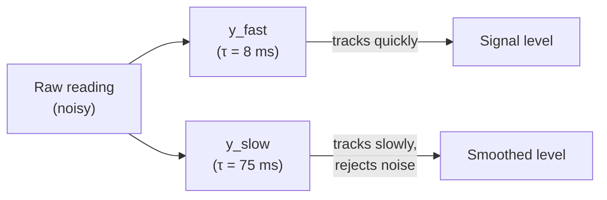
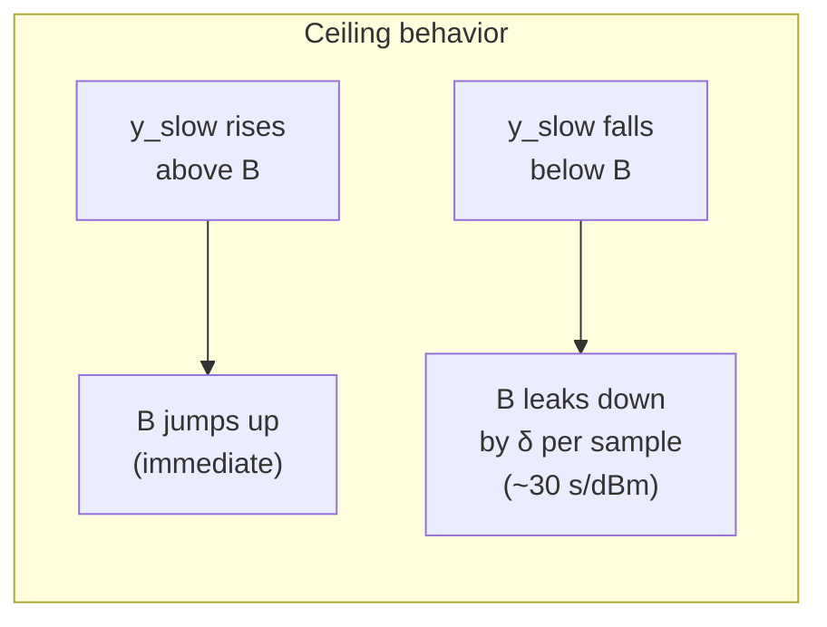
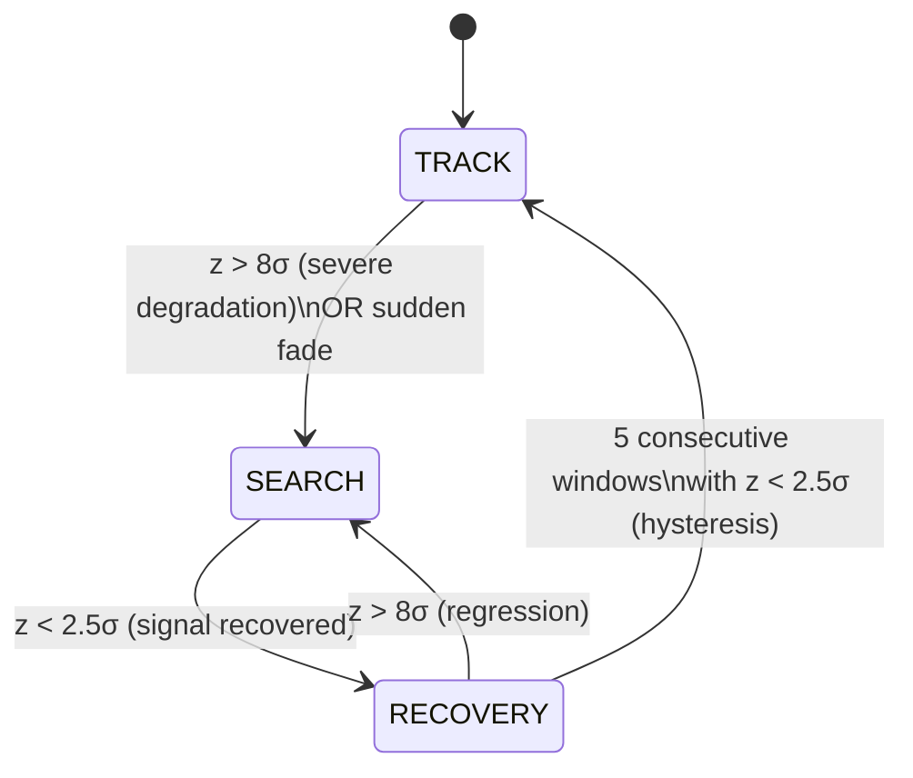
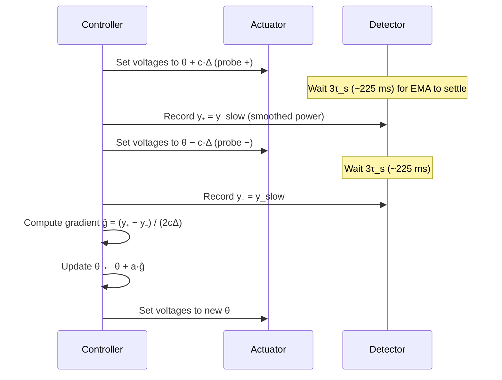
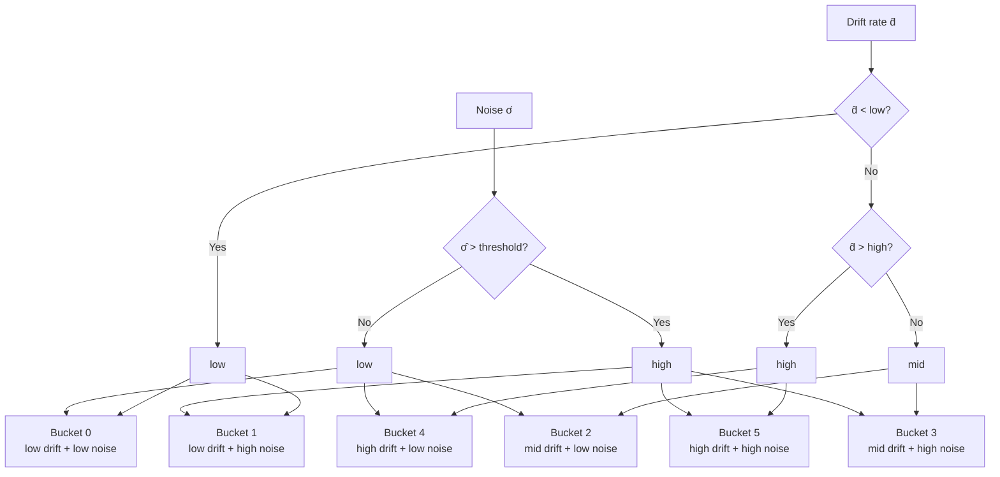
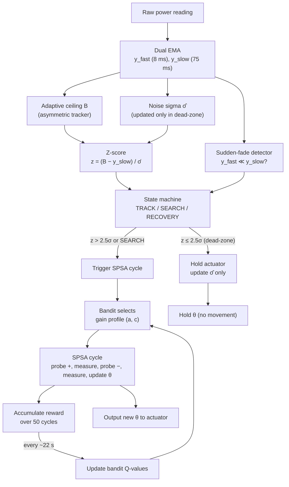
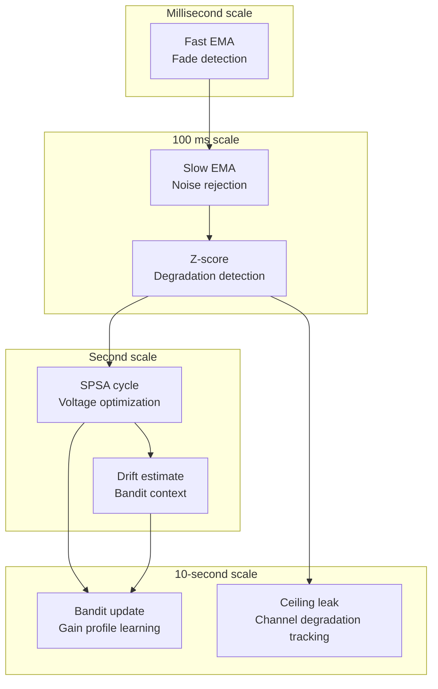

# Algorithm Description

> This document describes the polarization control algorithm — how it decides
> when to move the actuator, where to move it, and how aggressively. The
> physical problem (fiber-optic frequency transfer, beat note power, Poincaré
> sphere) is assumed known; we focus on the algorithm itself.

---

## Table of Contents

1. [Problem Statement](#1-problem-statement)
2. [Signal Conditioning: Dual-EMA and Adaptive Baseline](#2-signal-conditioning-dual-ema-and-adaptive-baseline)
3. [State Machine: TRACK / SEARCH / RECOVERY](#3-state-machine-track--search--recovery)
4. [SPSA Optimization](#4-spsa-optimization)
5. [Boundary-Aware Perturbation](#5-boundary-aware-perturbation)
6. [Contextual Bandit for Gain Adaptation](#6-contextual-bandit-for-gain-adaptation)
7. [Integration: How the Pieces Fit Together](#7-integration-how-the-pieces-fit-together)
8. [Summary of Design Choices](#8-summary-of-design-choices)

---

## 1. Problem Statement

We have four piezoelectric fiber squeezers (actuators), each accepting a
voltage in $[0, V_{\max}]$. The only feedback is a scalar: the (noisy) beat
note power, sampled at regular intervals. The goal is to maximize this power
despite:

- Unknown, time-varying SOP drift (ranging from quasi-static to fast),
- Noisy power measurements,
- A bounded actuator range,
- The desire to minimize unnecessary actuator movement (which itself introduces
  phase noise),
- No knowledge of the absolute power ceiling (which may degrade over time).

The controller must answer three questions, every millisecond:

1. **Should I move the actuator?** (Or is the signal good enough to leave alone?)
2. **If yes, in what direction and by how much?**
3. **How aggressively should I move?** (Small careful steps, or large bold ones?)

The algorithm addresses these with four cooperating components:

| Component | Answers | Core idea |
|-----------|---------|-----------|
| Adaptive baseline + sigma | Question 1 | Track the achievable ceiling and noise floor without hardcoded thresholds |
| FSM (TRACK / SEARCH / RECOVERY) | Question 1 | Decide *when* to actuate, with hysteresis to prevent oscillation |
| SPSA optimizer | Question 2 | Estimate the gradient with only 2 power measurements per step |
| Contextual bandit (UCB1) | Question 3 | Learn which aggressiveness level works best for the current drift/noise regime |

---

## 2. Signal Conditioning: Dual-EMA and Adaptive Baseline

Before any decision is made, the raw power reading must be cleaned up. The
raw signal is noisy, and we need to distinguish "noise" from "real degradation."
This section describes how.

### 2.1 Exponential Moving Average (EMA)

An **Exponential Moving Average** (EMA) is a weighted average where recent
samples carry more weight than old ones. At each time step, the EMA moves
a fraction $\alpha$ of the way toward the new reading:

$$y_{\text{ema}}^{(t)} = y_{\text{ema}}^{(t-1)} + \alpha \cdot \left( y_{\text{raw}}^{(t)} - y_{\text{ema}}^{(t-1)} \right)$$

- $\alpha = 0$: the EMA never moves (ignores all new data).
- $\alpha = 1$: the EMA always equals the latest reading (no smoothing).
- $\alpha$ small: strong smoothing, slow response.
- $\alpha$ large: weak smoothing, fast response.

The **time constant** $\tau$ (the time for the EMA to reach ~63% of a step
change) is related to $\alpha$ by $\alpha \approx \Delta t / \tau$, where
$\Delta t$ is the sampling interval.

### 2.2 Dual-EMA: Fast and Slow

The controller maintains **two** EMAs of the raw power reading, with different
time constants:

| EMA | Time constant | Smoothing | Purpose |
|-----|--------------|-----------|---------|
| $y_{\text{fast}}$ | $\tau_f \approx 8$ ms | Light | Tracks the signal quickly; detects sudden drops |
| $y_{\text{slow}}$ | $\tau_s \approx 75$ ms | Heavy | Smoothed signal; used for measurements and as baseline reference |



**Why two?** The fast EMA reacts quickly but is noisy; the slow EMA is smooth
but lags. The *gap* between them carries information: if the signal is stable,
they agree. If the signal drops suddenly, $y_{\text{fast}}$ falls first while
$y_{\text{slow}}$ still holds the old (higher) value — the gap reveals the
drop before the slow EMA catches up.

**Example:** A sudden 10 dB drop at $t = 100$ ms:

```
Power
  │
  │─────╮               ← true signal (step drop)
  │     │
  │     ╰──────────────
  │
  │─────╮
  │      ╲              ← y_fast (starts dropping within ~8 ms)
  │       ╲
  │        ╰───────────
  │
  │─────╮
  │      ╲              ← y_slow (starts dropping within ~75 ms,
  │       ╲                still high when y_fast has already fallen)
  │        ╲
  │         ╰──────────
  └──────────────────────→ t (ms)
        100
```

At $t \approx 108$ ms, $y_{\text{fast}}$ has already dropped significantly,
but $y_{\text{slow}}$ is still near the old level. This gap triggers the
sudden-fade detector (§3.1).

### 2.3 Adaptive Ceiling: The Asymmetric Tracker

**What is the ceiling?** The **ceiling** is the best beat note power that the
system could achieve right now if the polarization were perfectly aligned.
It is *not* a known constant — it depends on the channel condition (laser
power, connector quality, fiber bend loss, detector efficiency), all of which
can change slowly over time. The controller doesn't know the ceiling; it must
*estimate* it from the power readings.

Why does the controller need the ceiling? To decide whether the current power
is "good" or "bad." A reading of −45 dBm might be excellent (if the ceiling
is −44 dBm due to a degraded connector) or terrible (if the ceiling is −38
dBm and the polarization is misaligned). Without knowing the ceiling, the
controller can't tell the difference.

The ceiling estimate $B$ is updated by an **asymmetric integrator**:

$$B_{t+1} = \begin{cases} y_{\text{slow}}^{(t)} & \text{if } y_{\text{slow}}^{(t)} > B_t \quad \text{(rise: immediate)} \\ B_t - \delta & \text{otherwise} \quad \text{(fall: slow leak)} \end{cases}$$

where $\delta$ is a tiny constant (one least-significant-bit per sample).

**Intuition:** "Believe good news immediately, be skeptical of bad news."

- If the smoothed power *exceeds* the current ceiling estimate, the controller
  has found a better operating point than it thought possible. The ceiling
  snaps up instantly — there is no reason to doubt an improvement; the power
  really was that high.
- If the smoothed power is *below* the ceiling estimate, it could mean the
  ceiling has dropped (channel degradation) *or* it could be a transient dip
  (a fade that will recover). The ceiling doesn't drop to meet the signal.
  Instead, it leaks downward at a glacial pace (~30 seconds per dBm). If the
  dip is transient, the signal recovers before the ceiling has moved much, and
  no false alarm is triggered. If the dip is permanent, the ceiling eventually
  catches up.



**Why asymmetric?** Consider two scenarios:

1. **Connector degradation** (slow, ~1 dBm/s): The true ceiling drops gradually.
   The slow leak (30 s/dBm) is slow, but the degradation is slower still — the
   ceiling follows it, keeping the gap $B - y_{\text{slow}}$ small. No false
   alarm.

2. **Sudden fade** (fast, 10 dBm in 100 ms): The true signal drops, but the
   ceiling can't leak that fast. The gap $B - y_{\text{slow}}$ widens
   rapidly, the z-score (§2.5) spikes, and SEARCH is triggered. Correct
   response.

### 2.4 Noise Sigma Estimation

To decide whether a signal change is "real" or "just noise," we need to know
how much noise there is. The noise standard deviation $\hat{\sigma}_n$ is
estimated as an EMA of the **absolute residual** — how far each raw reading
deviates from the slow EMA:

$$\hat{\sigma}_n^{(t)} = \hat{\sigma}_n^{(t-1)} + \alpha_s \left( \left| y_{\text{raw}}^{(t)} - y_{\text{slow}}^{(t)} \right| - \hat{\sigma}_n^{(t-1)} \right)$$

Intuitively: if the raw signal jiggles ±0.5 dBm around the smooth trend, then
$|y_{\text{raw}} - y_{\text{slow}}| \approx 0.5$ on average, and $\hat{\sigma}_n$
converges to ~0.5.

**Critical detail:** This update runs **only when the controller is in
dead-zone** (signal is stable, no probing). During active optimization or
recovery, the signal changes are *real* (the controller moved the actuator),
not noise. Updating sigma then would contaminate the estimate.

### 2.5 Z-Score: The Scale-Invariant Degradation Signal

The **z-score** normalizes the gap to the ceiling by the noise level:

$$z_t = \frac{B_t - y_{\text{slow}}^{(t)}}{\max(\hat{\sigma}_n, \, \varepsilon)}$$

This answers: "How many noise-sigmas below the ceiling are we?"

- $z \approx 0$: we're at the ceiling, everything is fine.
- $z = 2.5$: we're 2.5 noise-sigmas below the ceiling — probably a real
  degradation, worth investigating.
- $z = 8$: we're 8 noise-sigmas below — severe degradation, need aggressive
  search.

**Why scale-invariant?** The thresholds (2.5σ, 8σ) are defined in *units of
the noise*, not in absolute dBm. So they work whether the ceiling is −38 dBm
with 0.3 dBm noise, or −50 dBm with 2 dBm noise. No hardcoded dBm values
anywhere in the decision logic.

### 2.6 Cold Start

At system startup, the ceiling is unknown. For the first 200 samples (~200 ms),
the z-score is set to $+\infty$, forcing the controller into SEARCH mode. After
warmup, $B$ is initialized to $y_{\text{slow}}$ and normal operation begins.

---

## 3. State Machine: TRACK / SEARCH / RECOVERY

The controller operates in one of three modes. The transitions are governed
by the z-score (§2.5) and the sudden-fade detector.



### 3.1 Sudden-Fade Detection

Before evaluating the z-score, a heuristic checks for rapid signal drops using
the two EMAs:

$$\text{if } \left( y_{\text{slow}} - y_{\text{fast}} \right) > 0.25 \cdot y_{\text{slow}} \quad \Longrightarrow \quad \text{SEARCH}$$

In words: if the fast EMA has dropped more than 25% below the slow EMA,
declare a sudden fade. This works because $y_{\text{fast}}$ reacts ~9× faster
than $y_{\text{slow}}$, so a sharp drop opens a visible gap between them before
the z-score (which uses the lagging $y_{\text{slow}}$) can register.

**Why not just use the z-score?** The z-score depends on $\hat{\sigma}_n$,
which may be stale or unreliable during transients. The sudden-fade detector
is a simple, robust heuristic that catches the most dangerous case (cable hit,
connector disconnect) within milliseconds, without relying on sigma.

### 3.2 Hysteresis

**What is hysteresis?** Hysteresis is a mechanism where the threshold for
*leaving* a state is stricter than the threshold for *entering* it, creating
a buffer zone that prevents rapid oscillation.

A familiar example is a thermostat: the heater turns on when the temperature
drops below 18°C, but doesn't turn off until it reaches 21°C. Without this
gap, the heater would rapidly toggle on and off when the temperature hovers
near 18°C. The 3-degree buffer is the hysteresis.

In our controller, the entry threshold for SEARCH is $z > 8\sigma$ (severe
degradation), but the exit threshold is $z < 2.5\sigma$ (clear recovery). If
the z-score bounces between 4 and 7 — degraded, but not catastrophic — the
controller stays in SEARCH rather than rapidly toggling between SEARCH and
TRACK. This is essential because each state change resets the optimization
cycle, and rapid toggling would prevent any real progress.

The RECOVERY → TRACK transition adds a *temporal* hysteresis on top: even
after $z$ drops below 2.5σ, the controller requires **5 consecutive windows**
of good signal before declaring "recovered." A single good reading isn't
enough — the signal must prove stability over time.

### 3.3 Transitions

| Transition | Condition | Rationale |
|------------|-----------|-----------|
| TRACK → SEARCH | $z > 8\sigma$ or sudden fade | Severe degradation: abandon fine-tuning, search aggressively |
| SEARCH → RECOVERY | $z < 2.5\sigma$ | Signal has recovered below the (lower) exit threshold — hysteresis prevents oscillation |
| RECOVERY → TRACK | 5 consecutive windows with $z < 2.5\sigma$ | Temporal hysteresis: require sustained recovery, not just a single good reading |
| RECOVERY → SEARCH | $z > 8\sigma$ | Regression: the recovery didn't hold |

### 3.4 Dead-Zone Gate

The **dead-zone** is the core mechanism for minimizing unnecessary actuator
movement. The optimizer is only allowed to actuate when:

$$\text{actuate} = \begin{cases} \text{yes} & \text{if in SEARCH (always)} \\ \text{yes} & \text{if } z > 2.5\sigma \text{ (degradation exceeds noise)} \\ \text{no} & \text{otherwise (dead-zone: signal is stable)} \end{cases}$$

When in the dead-zone, the controller does nothing — it only monitors. This
is by design: every piezo movement introduces phase noise, so the best move
is no move when the signal is already good.

### 3.5 Periodic Probe

Even in the dead-zone, a single optimization round is forced every ~30 seconds.
This serves two purposes:

1. **Re-confirm the optimum:** The drift may be so slow that the z-score never
   exceeds 2.5σ, but the operating point could still be slightly suboptimal.
   A periodic probe checks.
2. **Feed the bandit:** The bandit needs exploration data to learn which gain
   profile works best. Without periodic probes, the bandit would never get
   data in the stable regime.

The periodic probe is disabled in SEARCH (where exploration is already
continuous).

---

## 4. SPSA Optimization

### 4.1 The Problem

We want to maximize the beat note power by adjusting 4 voltages. This is a
4-dimensional optimization problem. The challenge: we can't compute the
gradient analytically (the relationship between voltages and power is
determined by the physical fiber link), and each function evaluation (power
measurement) is expensive — it requires ~225 ms of settling time.

A standard finite-difference approach would need $2 \times 4 = 8$ measurements
per gradient step (perturb each of the 4 axes one at a time). SPSA needs only
**2**, regardless of dimensionality.

### 4.2 The SPSA Idea

**Simultaneous Perturbation Stochastic Approximation** (Spall, 1992) estimates
the gradient by perturbing **all** coordinates at once, with random signs,
and measuring the power at two points:

1. Pick a random direction $\boldsymbol{\Delta} = (\pm 1, \pm 1, \pm 1, \pm 1)$
   — each component is independently +1 or −1 with equal probability.
2. Measure power at $\boldsymbol{\theta} + c \cdot \boldsymbol{\Delta}$ (call it $y_+$).
3. Measure power at $\boldsymbol{\theta} - c \cdot \boldsymbol{\Delta}$ (call it $y_-$).
4. Estimate the gradient:

$$\hat{g}_i = \frac{y_+ - y_-}{2 \, c \, \Delta_i}$$

5. Update: $\boldsymbol{\theta} \leftarrow \boldsymbol{\theta} + a \cdot \hat{\mathbf{g}}$.

**Intuition:** Imagine you're blindfolded on a hill and want to go up. You
can't measure the slope in each direction separately (too expensive). Instead,
you toss a 4-dimensional coin to pick a random diagonal direction, take one
step that way, measure your height, then take one step in the opposite
direction and measure again. If you went *up* in the +direction, the gradient
probably points that way; if *down*, it points the other way. The random
direction "mixes" all 4 coordinates, but on average, the estimate is unbiased.

**Worked example (2D):** Suppose the true power landscape is
$f(\theta) = -(\theta_1 - 20)^2 - (\theta_2 - 40)^2$, and we're at
$\boldsymbol{\theta} = (15, 35)$. We pick $\boldsymbol{\Delta} = (+1, -1)$,
$c = 2$.

- $y_+ = f(17, 33) = -9 - 49 = -58$
- $y_- = f(13, 37) = -49 - 9 = -58$
- $\hat{g}_1 = (-58 - (-58)) / (2 \cdot 2 \cdot 1) = 0$
- $\hat{g}_2 = (-58 - (-58)) / (2 \cdot 2 \cdot (-1)) = 0$

This particular perturbation gave a zero gradient (bad luck — the random
direction happened to be along a contour line). But over many iterations with
different random $\boldsymbol{\Delta}$, the *average* gradient estimate points
toward $(20, 40)$. That's the stochastic nature of SPSA: individual steps are
noisy, but the trajectory converges.

### 4.3 Measurement Protocol

Each SPSA iteration is a multi-step procedure:



**Why use $y_{\text{slow}}$ and not the raw reading?** Each power measurement
is noisy. The slow EMA averages out the noise over ~75 ms, giving a stable
reading. We wait $3\tau_s$ (~225 ms) for the EMA to settle to 95% of the new
level after a voltage change. This makes each SPSA cycle take ~450 ms — slow,
but necessary for reliable gradient estimates.

### 4.4 Per-Coordinate Perturbation Size

The perturbation magnitude $c$ is not uniform across all 4 sections. Each
section $i$ gets $c^{(i)} = c \cdot w(\theta^{(i)})$, where $w$ is the boundary
weight (§5). Near the actuator rails, $w$ shrinks, so the perturbation is
smaller — the optimizer "tiptoes" near edges.

The gradient formula becomes:

$$\hat{g}_i = \frac{y_+ - y_-}{2 \, c^{(i)} \, \Delta_i}$$

### 4.5 Gain Profiles

The gains $(a, c)$ — step size and perturbation size — are not fixed. They
are selected by the contextual bandit (§6) from a discrete set:

| Profile | Step size $a$ | Perturbation $c$ | When it's useful |
|---------|---------------|-------------------|------------------|
| 0 | small | small | Fine-tuning near the optimum (stable, low drift) |
| 1 | small | large | Cautious exploration (uncertain landscape) |
| 2 | large | small | Aggressive exploitation (know the direction, go fast) |
| 3 | large | large | Aggressive exploration (fast drift, need to cover ground) |
| SEARCH | very large | very large | Recovery from large perturbation (fixed override) |

In SEARCH mode, the bandit is bypassed and a fixed aggressive profile is used.

---

## 5. Boundary-Aware Perturbation

### 5.1 The Problem

Actuator voltages are bounded: $\theta^{(i)} \in [0, V_{\max}]$. Near the
rails, two issues arise:

1. **Wasted probes:** A random perturbation might push the voltage beyond the
   range, where it gets clamped. The probe is no longer symmetric, so the
   gradient estimate is biased.
2. **Getting stuck:** If $\theta^{(i)}$ is at 0V, the optimizer can't probe
   in the negative direction. It only sees the positive side and might
   conclude "the gradient is zero" when it's actually negative.

### 5.2 Perturbation Damping

A weight function $w(\theta)$ reduces the perturbation magnitude near the
rails:

$$w(\theta) = \begin{cases} 1.0 & \text{if } m \leq \theta \leq V_{\max} - m \\ 0.2 + 0.8 \cdot \frac{d}{m} & \text{otherwise} \end{cases}$$

where $m$ is the margin (e.g., 5V) and $d$ is the distance to the nearest rail.

```
Weight
  │
1.0│────────────────────────────────────────────
  │         ╱                          ╲
  │       ╱                              ╲
  │     ╱                                  ╲
0.2│   ●                                      ●
  └───┬──────┬──────────────────────┬──────┬───→ Voltage
      0V    5V                     55V    60V
           ←m→                    ←m→
         (damping zone)        (damping zone)
```

At the rail (0V or 60V), the perturbation shrinks to 20% of nominal. In the
center (5V–55V), it's full strength. The optimizer moves carefully when near
edges and freely when in the open.

### 5.3 Forced Inward Direction

When the actuator is *very* close to a rail (within $m_{\text{inward}}$,
e.g., 2V), the random perturbation direction is overridden:

| Position | Direction | Why |
|----------|-----------|-----|
| $\theta < 2$V | $\Delta = +1$ (always probe upward) | Can't probe downward — force inward |
| $\theta > 58$V | $\Delta = -1$ (always probe downward) | Can't probe upward — force inward |
| Otherwise | $\Delta = \pm 1$ (random) | Normal operation |

This guarantees the probe always moves away from the rail, preventing the
optimizer from being stuck.

### 5.4 Disabled in SEARCH

During SEARCH, boundary weighting is disabled ($w \equiv 1$ everywhere). This
is a deliberate trade-off: in SEARCH, the system is far from the optimum and
needs aggressive exploration across the *entire* range. Edge-avoidance would
slow recovery. Once the system returns to TRACK, boundary weighting resumes.

---

## 6. Contextual Bandit for Gain Adaptation

### 6.1 Why Adapt the Gains?

The optimal SPSA gains $(a, c)$ depend on the operating regime:

- **Slow drift, low noise:** Small gains work best — the signal is nearly
  stationary, so careful steps find the precise optimum without wasting
  movement.
- **Fast drift, high noise:** Large gains are needed — the optimum is moving,
  so the controller must track aggressively despite the noise.

Since the drift regime changes over time (e.g., a calm morning followed by a
vibrating afternoon), a fixed gain is always suboptimal for some conditions.
The controller needs to *learn* which gains work best for the current regime.

### 6.2 The Contextual Bandit Framework

A **contextual bandit** is a repeated decision problem:

1. Observe the **context** (what are the current drift and noise conditions?).
2. Choose an **arm** (which gain profile to use).
3. Receive a **reward** (how well did that profile work?).
4. Update the estimate for that (context, arm) pair.

The challenge is the **exploration-exploitation dilemma**: should we use the
arm that has worked best so far (exploitation), or try a different arm that
might be better (exploration)? UCB1 resolves this with a mathematical
guarantee of near-optimal performance.

### 6.3 Context: What Information Drives the Choice?

The context is two-dimensional:

- **Drift rate** $\hat{d}$: How fast is the optimum moving? Estimated as the
  EMA of the mean gradient magnitude $\frac{1}{4}\sum_i |\hat{g}_i|$. If the
  gradients are large, the optimum is shifting quickly.
- **Noise level** $\hat{\sigma}_n$: How noisy is the measurement? (From §2.4.)

These are discretized into 6 buckets (3 drift levels × 2 noise levels):



Each bucket maintains its own independent statistics for the 4 arms.

### 6.4 UCB1: Balancing Exploration and Exploitation

The **UCB1** algorithm (Auer, Cesa-Bianchi, Fischer, 2002) selects the arm
that maximizes:

$$\text{score}(a) = \underbrace{Q(b, a)}_{\text{exploitation}} + \underbrace{C \sqrt{\frac{\ln(N+1)}{n(b,a)+1}}}_{\text{exploration bonus}}$$

where:
- $Q(b, a)$: the average reward observed for arm $a$ in bucket $b$ (how well
  has it done historically?).
- $n(b, a)$: how many times arm $a$ has been tried in bucket $b$.
- $N$: total number of pulls in bucket $b$.
- $C$: exploration constant (e.g., 2.0).

**Intuition:** The first term favors arms that have worked well (exploitation).
The second term is large for arms that have been tried *rarely* — it decreases
as $n(b,a)$ grows, so it pushes the controller to try under-explored arms.
As an arm is tried more, its exploration bonus shrinks, and the controller
settles on the best one. UCB1 guarantees that the cumulative regret grows
only logarithmically: $R_T = O(\log T)$.

**Example:** After 100 pulls in bucket 0:

| Arm | $Q$ (avg reward) | $n$ (pulls) | Exploration bonus | Score |
|-----|-------------------|-------------|-------------------|-------|
| 0 | 20.0 | 60 | $2\sqrt{\ln(101)/61} \approx 0.55$ | 20.55 |
| 1 | 18.0 | 25 | $2\sqrt{\ln(101)/26} \approx 0.84$ | 18.84 |
| 2 | 21.0 | 10 | $2\sqrt{\ln(101)/11} \approx 1.30$ | 22.30 ← selected |
| 3 | 15.0 | 5 | $2\sqrt{\ln(101)/6} \approx 1.77$ | 16.77 |

Arm 2 is selected: it has both a high average reward (21.0) and hasn't been
tried much (only 10 times), so there's still uncertainty about its true value.
Arm 0 has the second-highest reward (20.0) but has been tried 60 times — the
exploration bonus is small, suggesting we're fairly confident it's not the
best.

### 6.5 Reward Design

The reward is computed as the average over a window of $W = 50$ SPSA cycles
(~22 seconds):

$$r = \underbrace{\overline{y_{\text{slow}}}}_{\substack{\text{sustained}\\\text{power}}} - \lambda \cdot \underbrace{\overline{f_{\text{boundary}}}}_{\substack{\text{edge}\\\text{proximity}}} - \mu \cdot \underbrace{\overline{\Delta\theta}}_{\substack{\text{actuator}\\\text{movement}}}$$

| Term | What it measures | Why it matters |
|------|-----------------|----------------|
| $\overline{y_{\text{slow}}}$ | Mean smoothed power | Primary goal: maximize power |
| $f_{\text{boundary}}$ | Fraction of sections in the edge zone | Penalize operating near rails (wastes dynamic range) |
| $\Delta\theta$ | Total voltage movement $\sum_i |\Delta\theta_i|$ | Penalize excessive actuator churn (introduces phase noise) |

This multi-objective reward encodes the physical trade-off: high power is the
primary goal, but not at the cost of rattling the actuator or operating at the
rails.

### 6.6 Credit Assignment

The arm is selected **once per SPSA cycle** (at the start), and remains fixed
for the entire 450 ms cycle. The reward is attributed to the (context, arm)
pair that was active during the window.

In SEARCH mode, the bandit is **not updated** — the SEARCH gain override was
in effect, not the bandit's chosen arm. Updating the bandit with rewards from
a policy it didn't choose would contaminate the Q-table.

---

## 7. Integration: How the Pieces Fit Together



### Timing

| Timescale | What happens |
|-----------|-------------|
| 1 ms | Every sample: update EMAs, compute z-score, update FSM |
| ~8 ms | $y_{\text{fast}}$ detects a sudden drop |
| ~75 ms | $y_{\text{slow}}$ settles to a new level |
| ~225 ms | SPSA probe settling (3× slow EMA for 95% convergence) |
| ~450 ms | One complete SPSA cycle (probe +, settle, probe −, settle, update) |
| ~30 s | Periodic probe (if in dead-zone); ceiling leaks ~1 dBm |
| ~22 s | Bandit update window (50 SPSA cycles) |

The FSM runs every sample (1 ms), continuously monitoring for degradation
even while an SPSA cycle is in progress. A sudden fade can interrupt the
current cycle and force SEARCH on the next trigger.

### Hierarchy of Adaptation

The system adapts at multiple timescales simultaneously:



This layered structure lets the controller react at the appropriate speed for
each phenomenon: fast enough to catch sudden fades within milliseconds, slow
enough to avoid chasing noise, and patient enough to learn which gains work
best over tens of seconds.

---

## 8. Summary of Design Choices

1. **No hardcoded dBm thresholds.** All decisions use the z-score, normalized
   by the estimated noise sigma. The system adapts to whatever power level and
   noise regime it encounters.

2. **Asymmetric ceiling tracker.** Improvements are trusted immediately;
   degradations must prove themselves over ~30 seconds. This distinguishes
   genuine channel degradation (slow) from transient fades (fast).

3. **SPSA for gradient-free optimization.** Only 2 measurements per gradient
   estimate, regardless of dimensionality. Essential when each measurement
   requires ~225 ms of settling time.

4. **Boundary-aware perturbation.** The optimizer "tiptoes" near actuator
   rails and forces inward perturbation when very close, preventing the
   optimizer from getting stuck. Disabled during SEARCH for aggressive
   recovery.

5. **Contextual bandit for gain adaptation.** UCB1 with a 6-bucket context
   (drift × noise) selects from 4 gain profiles, adapting the optimizer's
   aggressiveness to the current regime. Logarithmic regret guarantee.

6. **Multi-objective reward.** The bandit optimizes not just power, but also
   penalizes actuator movement and edge operation — encoding the physical
   trade-off between tracking performance and phase-noise minimization.

7. **Hierarchical timescales.** The system reacts at the appropriate speed
   for each phenomenon: millisecond-scale fade detection, sub-second SPSA
   optimization, tens-of-seconds bandit adaptation.
