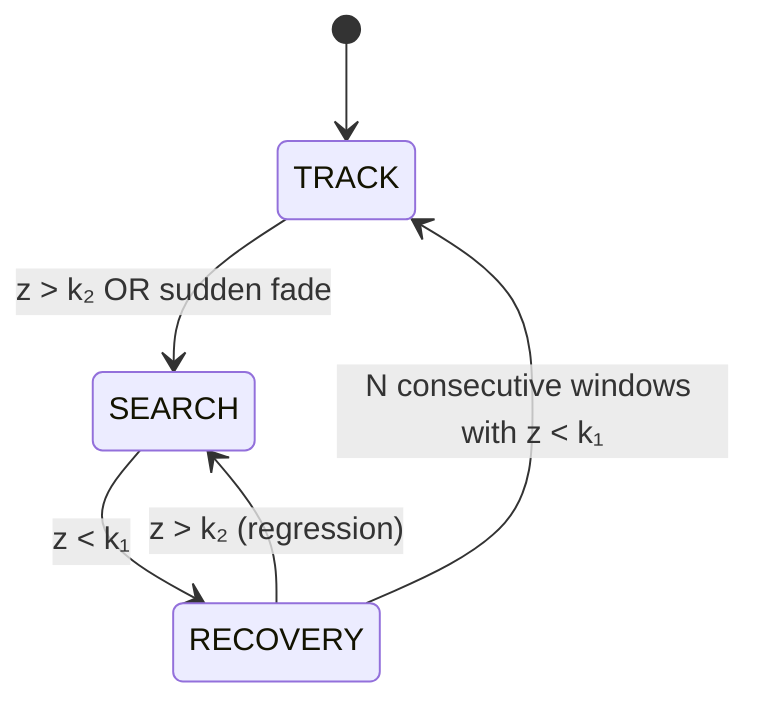
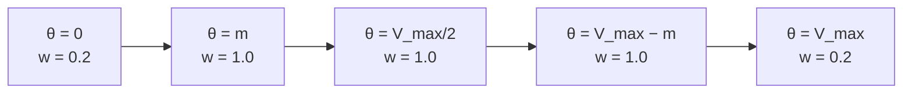
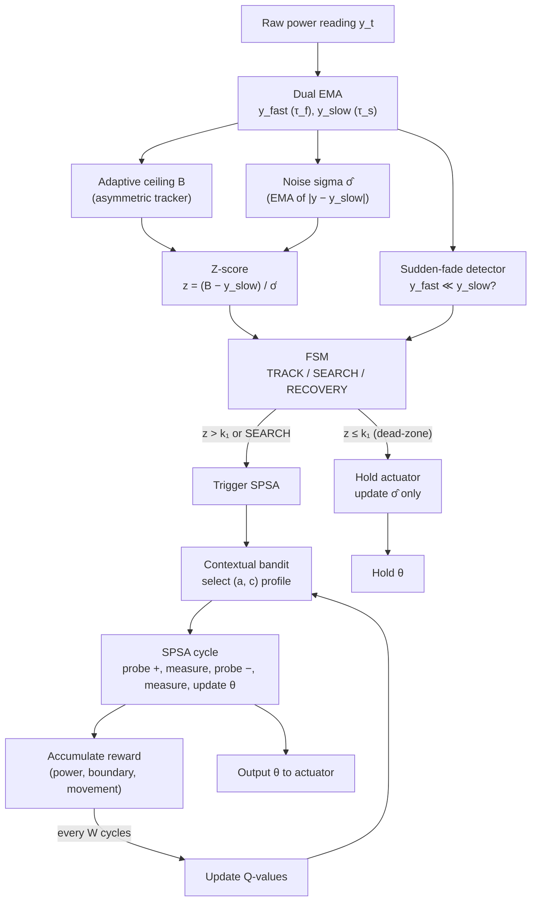

# Algorithm Description

> This document describes the polarization control algorithm in theoretical terms,
> independent of any implementation. The algorithm maximizes the beat note optical
> power in a fiber-optic link by adjusting four piezoelectric fiber squeezers.

---

## Table of Contents

1. [Problem Statement](#1-problem-statement)
2. [System Model](#2-system-model)
3. [Signal Conditioning: Dual-EMA and Adaptive Baseline](#3-signal-conditioning-dual-ema-and-adaptive-baseline)
4. [State Machine: TRACK / SEARCH / RECOVERY](#4-state-machine-track--search--recovery)
5. [SPSA Optimization](#5-spsa-optimization)
6. [Boundary-Aware Perturbation](#6-boundary-aware-perturbation)
7. [Contextual Bandit for Gain Adaptation](#7-contextual-bandit-for-gain-adaptation)
8. [Integration: How the Pieces Fit Together](#8-integration-how-the-pieces-fit-together)
9. [Summary of Design Choices](#9-summary-of-design-choices)

---

## 1. Problem Statement

We consider an optical fiber link used for frequency transfer. A local laser
is combined with the incoming signal, and the resulting **beat note** power
depends on the relative state of polarization (SOP) between the two. Environmental
perturbations (temperature, vibration, cable movement) cause the SOP to drift
stochastically over time.

A **polarization controller** — four piezoelectric fiber squeezers acting as
variable retarders — can compensate this drift. Each squeezer accepts a voltage
in $[0, V_{\max}]$ and introduces a birefringence proportional to that voltage.
The four sections are arranged in two orthogonal pairs, giving sufficient
degrees of freedom to transform any input SOP to any target SOP on the Poincaré
sphere.

**Goal:** Maximize the beat note power (equivalently, minimize the angular
distance between the output SOP and a reference SOP) despite:

- Unknown, time-varying SOP drift (ranging from quasi-static to fast),
- Noisy power measurements,
- A bounded actuator range,
- The desire to minimize unnecessary actuator movement (which itself introduces
  phase noise),
- No knowledge of the absolute power ceiling (which may degrade over time due
  to connector aging, bend loss, etc.).

The only feedback signal is a scalar: the (noisy) beat note power, sampled at
regular intervals.

---

## 2. System Model

### 2.1 Poincaré Sphere Representation

The SOP is represented as a point on the unit sphere $S^2$ via the normalized
Stokes vector $\mathbf{s} = (s_1, s_2, s_3)$ with $|\mathbf{s}| = 1$.

The beat note power depends on the angular distance $\alpha$ between the
output SOP $\mathbf{s}_{\text{out}}$ and a reference SOP $\mathbf{s}_{\text{ref}}$:

$$I = \cos^2\!\left(\frac{\alpha}{2}\right), \qquad \alpha = \arccos\!\left(\frac{\mathbf{s}_{\text{out}} \cdot \mathbf{s}_{\text{ref}}}{|\mathbf{s}_{\text{out}}|\,|\mathbf{s}_{\text{ref}}|}\right)$$

This is the Malus-type law: $I = 1$ when the SOPs are aligned ($\alpha = 0$),
$I = 0.5$ when orthogonal in the Stokes sense ($\alpha = \pi/2$, 3 dB loss),
and $I = 0$ when antiparallel ($\alpha = \pi$).

The power in dBm is:

$$P = P_{\text{ceiling}} + 10 \log_{10}(I + \varepsilon)$$

where $P_{\text{ceiling}}$ is the best achievable power (when $I = 1$) and
$\varepsilon$ is a small constant to avoid $\log(0)$.

### 2.2 Actuator Model

The four sections act as sequential retarders. Sections $\{1, 2\}$ rotate the
SOP around axis $\mathbf{e}_1 = (1, 0, 0)$; sections $\{3, 4\}$ around the
orthogonal axis $\mathbf{e}_2 = (0, 1, 0)$. The rotation angle of section $i$
is $\phi_i = (V_i / V_{\max}) \cdot 2\pi$.

The output SOP is:

$$\mathbf{s}_{\text{out}} = R_4 \, R_3 \, R_2 \, R_1 \, \mathbf{s}_{\text{in}}$$

where $R_i$ is the rotation matrix (Rodrigues' formula) for section $i$. The
input SOP $\mathbf{s}_{\text{in}}$ is subject to environmental drift.

### 2.3 Drift Model

The input SOP drifts according to an Ornstein-Uhlenbeck (OU) process on the
sphere:

$$dX = -\frac{X}{\tau} \, dt + \sigma \, dW$$

applied to the azimuthal and elevational angles independently, where $\tau$ is
the time constant (larger $\tau$ = slower drift), $\sigma$ is the diffusion
amplitude, and $W$ is a Wiener process. This produces correlated, mean-reverting
drift — more realistic than white noise.

### 2.4 Measurement Noise

Two noise regimes are modeled:

1. **White Gaussian:** $P_{\text{obs}} = P + \mathcal{N}(0, \sigma_n)$
2. **Interferometric:** A composite of multiple sinusoidal components (parasitic
   interferometers beating at different frequencies) plus a white component.
   This is structurally non-Gaussian and non-stationary.

---

## 3. Signal Conditioning: Dual-EMA and Adaptive Baseline

### 3.1 Dual Exponential Moving Average

Two EMAs of the raw power reading $y_t$ are maintained:

$$y_{\text{fast}}^{(t)} = y_{\text{fast}}^{(t-1)} + \alpha_f \left( y_t - y_{\text{fast}}^{(t-1)} \right), \qquad \alpha_f = \frac{\Delta t}{\tau_f}$$

$$y_{\text{slow}}^{(t)} = y_{\text{slow}}^{(t-1)} + \alpha_s \left( y_t - y_{\text{slow}}^{(t-1)} \right), \qquad \alpha_s = \frac{\Delta t}{\tau_s}$$

with $\tau_f \ll \tau_s$ (e.g., $\tau_f = 8$ ms, $\tau_s = 75$ ms).

| Signal | Time constant | Role |
|--------|--------------|------|
| $y_{\text{fast}}$ | $\tau_f$ (short) | Tracks the signal quickly; used for sudden-fade detection |
| $y_{\text{slow}}$ | $\tau_s$ (long) | Smoothed signal; used as the SPSA measurement and baseline reference |

### 3.2 Adaptive Ceiling (Asymmetric Tracker)

The estimated achievable power ceiling $B_t$ is updated by an **asymmetric
integrator**:

$$B_{t+1} = \begin{cases} y_{\text{slow}}^{(t)} & \text{if } y_{\text{slow}}^{(t)} > B_t \quad \text{(fast rise)} \\ B_t - \delta & \text{otherwise} \quad \text{(slow linear decay)} \end{cases}$$

where $\delta$ is a small constant step (one least-significant-bit per sample).

**Rationale:** This design encodes an asymmetric belief about the signal:
improvements are trusted immediately (the ceiling snaps up), while degradations
are treated with skepticism (the ceiling leaks downward slowly, over ~30 s per
dBm). This means:

- A **genuine ceiling drop** (e.g., connector degradation at ~1 dBm/s) is
  tracked, keeping the gap $B - y_{\text{slow}}$ small and avoiding false
  alarms.
- A **transient dip** (sudden fade, faster than 30 s) is faster than the leak,
  so the ceiling holds high, the gap widens, and the z-score spikes — correctly
  triggering aggressive search.

### 3.3 Noise Sigma Estimation

The noise standard deviation $\hat{\sigma}_n$ is estimated as an EMA of the
absolute residual:

$$\hat{\sigma}_n^{(t)} = \hat{\sigma}_n^{(t-1)} + \alpha_s \left( |y_t - y_{\text{slow}}^{(t)}| - \hat{\sigma}_n^{(t-1)} \right)$$

This update is performed **only when the controller is in dead-zone** (i.e.,
the signal is considered stable and no active probing is occurring). This
prevents contamination of the noise estimate by real signal changes during
optimization or recovery.

### 3.4 Z-Score

The normalized degradation signal is:

$$z_t = \frac{B_t - y_{\text{slow}}^{(t)}}{\max(\hat{\sigma}_n, \, \varepsilon)}$$

This is **scale-invariant**: it expresses the gap to the ceiling in units of
the estimated noise standard deviation. The thresholds $k_1$ and $k_2$ (see
§4) are defined in these units, so they work regardless of the absolute power
level or noise amplitude. No hardcoded dBm values appear anywhere in the
decision logic.

### 3.5 Cold Start

During an initial warmup period (e.g., 200 samples), the ceiling is
uninitialized and $z_t$ is set to $+\infty$, forcing the controller into
SEARCH mode. After warmup, $B$ is initialized to $y_{\text{slow}}$ and normal
operation begins.

---

## 4. State Machine: TRACK / SEARCH / RECOVERY

The controller operates in one of three modes, governed by the z-score and
a sudden-fade detector.

### 4.1 Sudden-Fade Detection

Before the z-score is evaluated, a heuristic checks for rapid signal drops:

$$\text{if } \left( y_{\text{slow}} - y_{\text{fast}} \right) > \beta \cdot y_{\text{slow}} \quad \text{then SEARCH}$$

with $\beta = 0.25$ (the fast EMA has dropped more than 25% below the slow EMA).

Since $y_{\text{fast}}$ reacts approximately $\tau_s / \tau_f \approx 9\times$
faster than $y_{\text{slow}}$, a sharp drop opens a large gap between the two
EMAs before the z-score (which uses the lagging $y_{\text{slow}}$) can register.
This provides a fast detection path independent of the sigma estimate, which
may be unreliable during transients.

### 4.2 Transitions

| Transition | Condition | Notes |
|------------|-----------|-------|
| TRACK → SEARCH | $z > k_2$ or sudden fade | $k_2 = 8\sigma$: severe degradation |
| SEARCH → RECOVERY | $z < k_1$ | $k_1 = 2.5\sigma$: signal recovered to dead-zone |
| RECOVERY → TRACK | $N$ consecutive windows with $z < k_1$ | $N = 5$: hysteresis prevents oscillation |
| RECOVERY → SEARCH | $z > k_2$ | Regression: signal degraded again |

### 4.3 Dead-Zone Gate

The dead-zone gate determines whether the optimizer should actuate:

$$\text{actuate} = \begin{cases} \text{true} & \text{if mode = SEARCH} \\ \text{true} & \text{if } z > k_1 \quad \text{(TRACK or RECOVERY)} \\ \text{false} & \text{otherwise (dead-zone: signal is stable)} \end{cases}$$

When in the dead-zone, the controller does not move the actuator — it only
monitors. This reduces unnecessary phase noise from piezo movement.

### 4.4 Periodic Probe

Even in the dead-zone, a single optimization round is forced every $T_{\text{probe}}$
(e.g., 30 s). This serves two purposes: (1) re-confirm that the current operating
point is still optimal, and (2) provide exploration data to the bandit. The
periodic probe is disabled in SEARCH mode (where exploration is already
continuous).

---

## 5. SPSA Optimization

### 5.1 The SPSA Principle

The **Simultaneous Perturbation Stochastic Approximation** (Spall, 1992)
estimates the gradient of an objective function $f(\boldsymbol{\theta})$ using
only **two** function evaluations per iteration, regardless of the dimensionality
of $\boldsymbol{\theta}$.

For a parameter vector $\boldsymbol{\theta} \in \mathbb{R}^d$ ($d = 4$ here),
the SPSA gradient estimate at iteration $k$ is:

$$\hat{g}_k^{(i)} = \frac{f(\boldsymbol{\theta}_k + c_k \boldsymbol{\Delta}_k) - f(\boldsymbol{\theta}_k - c_k \boldsymbol{\Delta}_k)}{2 \, c_k \, \Delta_k^{(i)}}$$

where:
- $\boldsymbol{\Delta}_k = (\Delta_k^{(1)}, \ldots, \Delta_k^{(d)})$ is a random
  perturbation vector with each component $\Delta_k^{(i)} \in \{-1, +1\}$,
  drawn independently,
- $c_k > 0$ is the perturbation magnitude.

The parameter update is:

$$\boldsymbol{\theta}_{k+1} = \boldsymbol{\theta}_k + a_k \, \hat{\mathbf{g}}_k$$

where $a_k > 0$ is the step size (gain).

**Key advantage:** Only 2 measurements are needed per gradient estimate,
whether $d = 4$ or $d = 100$. This is critical when each measurement is
expensive (here, each requires settling time for the EMA to converge).

### 5.2 Measurement Protocol

Each SPSA iteration consists of:

1. Generate random perturbation $\boldsymbol{\Delta}_k$.
2. Set actuator to $\boldsymbol{\theta}_k + c_k \boldsymbol{\Delta}_k$ (probe point +).
3. Wait for the slow EMA to settle (time $\approx 3\tau_s$ for 95% convergence).
4. Record $y_+ = y_{\text{slow}}$ (the smoothed power at probe +).
5. Set actuator to $\boldsymbol{\theta}_k - c_k \boldsymbol{\Delta}_k$ (probe point −).
6. Wait for settling.
7. Record $y_- = y_{\text{slow}}$.
8. Compute $\hat{\mathbf{g}}_k$ and update $\boldsymbol{\theta}_{k+1}$.

Using $y_{\text{slow}}$ rather than the raw reading as the measurement rejects
measurement noise (the EMA acts as a low-pass filter).

### 5.3 Per-Coordinate Perturbation

The perturbation magnitude $c_k$ is applied **per coordinate**, but each
coordinate $i$ may have a different effective magnitude $c_k^{(i)} = c_k \cdot w(\theta_k^{(i)})$,
where $w$ is the boundary weight (see §6). The gradient formula becomes:

$$\hat{g}_k^{(i)} = \frac{y_+ - y_-}{2 \, c_k^{(i)} \, \Delta_k^{(i)}}$$

### 5.4 Gain Profiles

The gains $(a, c)$ are not fixed — they are selected by the contextual bandit
(see §7) from a discrete set of profiles:

| Profile | $a$ (step size) | $c$ (perturbation) | Character |
|---------|-----------------|---------------------|-----------|
| 0 | small | small | Conservative (fine-tune near optimum) |
| 1 | small | large | Cautious exploration |
| 2 | large | small | Aggressive exploitation |
| 3 | large | large | Aggressive exploration |
| SEARCH | very large | very large | Fixed override (recovery from large perturbation) |

In SEARCH mode, the bandit is bypassed and a fixed aggressive profile is used.

---

## 6. Boundary-Aware Perturbation

### 6.1 Problem

The actuator voltages are bounded: $\theta^{(i)} \in [0, V_{\max}]$. Near the
rails, two issues arise:
- Random perturbations may push the voltage beyond the range (wasting a
  measurement).
- The optimizer may get "stuck" against a rail, unable to explore the
  gradient in one direction.

### 6.2 Perturbation Damping

A weight function reduces the perturbation magnitude near the rails:

$$w(\theta) = \begin{cases} 1 & \text{if } m \leq \theta \leq V_{\max} - m \\ w_{\min} + (1 - w_{\min}) \cdot \frac{d(\theta)}{m} & \text{otherwise} \end{cases}$$

where:
- $m$ is the margin (e.g., 5V) within which damping is active,
- $d(\theta) = \min(\theta, \, V_{\max} - \theta)$ is the distance to the nearest rail,
- $w_{\min}$ is the floor weight (e.g., 0.2).

The effective perturbation is $c^{(i)} = c \cdot w(\theta^{(i)})$. At the rail,
the perturbation shrinks to 20% of nominal, making the optimizer "tiptoe" near
edges.

### 6.3 Forced Inward Direction

When the actuator is within a very small margin $m_{\text{inward}}$ (e.g., 2V)
of a rail, the perturbation direction is forced inward rather than random:

$$\Delta_k^{(i)} = \begin{cases} +1 & \text{if } \theta^{(i)} < m_{\text{inward}} \\ -1 & \text{if } \theta^{(i)} > V_{\max} - m_{\text{inward}} \\ \text{random } \pm 1 & \text{otherwise} \end{cases}$$

This guarantees that the next probe moves away from the rail, preventing
the optimizer from being stuck.

### 6.4 Disabled in SEARCH

During SEARCH, the boundary weighting is disabled ($w \equiv 1$), and the full
perturbation magnitude is used everywhere. This is a deliberate trade-off: in
SEARCH, the system is far from the optimum and needs aggressive exploration
across the entire range. Edge-avoidance would slow recovery.

---

## 7. Contextual Bandit for Gain Adaptation

### 7.1 Motivation

The optimal SPSA gains $(a, c)$ depend on the operating conditions:
- **Slow drift, low noise:** small gains suffice (fine-tune and hold),
- **Fast drift, high noise:** large gains needed (track aggressively despite
  noise).

Since the drift regime changes over time, a fixed gain profile is suboptimal.
We use a **contextual bandit** to adaptively select the gain profile based on
the current drift/noise context.

### 7.2 Contextual Bandit Framework

A contextual bandit is a sequential decision problem where, at each round $t$:
1. The agent observes a **context** $\mathbf{x}_t$,
2. Selects an **arm** (action) $a_t$ from a set of $K$ arms,
3. Receives a **reward** $r_t$,
4. Updates its policy.

The goal is to minimize cumulative regret: the gap between the reward of the
best arm for each context and the reward actually obtained.

### 7.3 Context Discretization

The context is two-dimensional: $(\hat{d}_t, \hat{\sigma}_n)$, where:
- $\hat{d}_t$ is the estimated drift rate (EMA of the mean gradient magnitude
  $\frac{1}{d}\sum_i |\hat{g}^{(i)}_k|$, smoothed over iterations),
- $\hat{\sigma}_n$ is the estimated noise sigma (from §3.3).

This is discretized into $3 \times 2 = 6$ buckets:

| | Low noise | High noise |
|---|-----------|------------|
| Low drift | Bucket 0 | Bucket 1 |
| Mid drift | Bucket 2 | Bucket 3 |
| High drift | Bucket 4 | Bucket 5 |

### 7.4 UCB1 Policy

The arm is selected using the **UCB1** algorithm (Auer, Cesa-Bianchi, Fischer
2002), which balances exploration and exploitation:

$$a_t = \arg\max_a \left[ Q(b, a) + C \sqrt{\frac{\ln(N+1)}{n(b,a)+1}} \right]$$

where:
- $Q(b, a)$ is the estimated mean reward for arm $a$ in bucket $b$,
- $n(b, a)$ is the number of times arm $a$ has been selected in bucket $b$,
- $N$ is the total number of pulls across all arms in bucket $b$,
- $C$ is the exploration constant (e.g., $C = 2.0$).

The first term exploits the arm with the highest observed reward; the second
term (the **exploration bonus**) favors arms that have been tried less often.
UCB1 has a logarithmic regret guarantee: $R_T = O(\log T)$.

### 7.5 Q-Value Update

After receiving reward $r_t$, the Q-value is updated via an EMA:

$$Q(b, a) \leftarrow Q(b, a) + \alpha \cdot (r_t - Q(b, a))$$

with $\alpha = 1 / \min(n(b,a), \, n_{\max})$. The cap $n_{\max}$ (e.g., 255)
prevents the learning rate from becoming negligibly small — the Q-value
continues to adapt slowly even after many pulls, rather than freezing.

### 7.6 Reward Design

The reward is computed as the average over a window of $W$ SPSA iterations
(e.g., $W = 50$):

$$r = \underbrace{\overline{y_{\text{slow}}}}_{\text{sustained power}} - \lambda \cdot \underbrace{\overline{f_{\text{boundary}}}}_{\text{edge proximity}} - \mu \cdot \underbrace{\overline{\Delta\theta}}_{\text{actuator movement}}$$

where:
- $\overline{y_{\text{slow}}}$ is the mean smoothed power (higher is better),
- $f_{\text{boundary}} \in [0, 1]$ is the fraction of sections operating in
  the boundary zone (penalizes operating near rails),
- $\Delta\theta = \sum_i |\theta^{(i)}_{k+1} - \theta^{(i)}_k|$ is the total
  voltage movement (penalizes excessive actuator churn),
- $\lambda, \mu$ are weighting constants.

This multi-objective reward encodes the physical trade-offs: high power is the
primary goal, but unnecessary movement and edge operation are discouraged.

### 7.7 Credit Assignment

The arm is selected once per SPSA cycle and remains fixed for the entire cycle.
The reward is attributed to the $(context, arm)$ pair that was active at the
start of the window. In SEARCH mode, the bandit is not updated (the arm was
not used — the SEARCH gain override was in effect), preventing contamination
of the Q-table with rewards from a policy the bandit did not choose.

---

## 8. Integration: How the Pieces Fit Together

The complete algorithm is a hierarchical control loop:

### Timing

Each SPSA cycle takes $2 \times 3\tau_s + 3 \approx 6\tau_s$ time units (two
settling periods plus three transition steps). With $\tau_s = 75$ ms, this is
~453 ms per cycle. The bandit is updated every $W = 50$ cycles (~22.5 s).

The FSM runs every sample (1 ms), continuously monitoring for degradation
even while an SPSA cycle is in progress. A sudden fade can interrupt the
current cycle and force SEARCH on the next trigger.

### Hierarchy of Adaptation Timescales

| Component | Timescale | What it adapts |
|-----------|-----------|----------------|
| Fast EMA | $\tau_f \approx 8$ ms | Signal tracking (fade detection) |
| Slow EMA | $\tau_s \approx 75$ ms | SPSA measurement (noise rejection) |
| Noise sigma | $\sim\tau_s$ | Dead-zone threshold (scale-invariant) |
| Adaptive ceiling (rise) | 1 step | Immediate trust of improvements |
| Adaptive ceiling (fall) | ~30 s/dBm | Slow tracking of degradation |
| SPSA cycle | ~450 ms | Voltage optimization |
| Bandit update | ~22 s | Gain profile selection |
| Drift estimate | $\sim\tau_s$ | Bandit context (drift level) |

This layered structure allows the controller to react at the appropriate
timescale for each phenomenon: fast enough to catch sudden fades within
milliseconds, slow enough to avoid chasing noise.

---

## 9. Summary of Design Choices

1. **No hardcoded dBm thresholds.** All decisions are based on the z-score,
   which is normalized by the estimated noise sigma. The system adapts to
   whatever power level and noise regime it encounters.

2. **Asymmetric ceiling tracker.** Improvements are trusted immediately;
   degradations must prove themselves over ~30 seconds. This distinguishes
   genuine channel degradation (slow) from transient fades (fast).

3. **SPSA for gradient-free optimization.** Only 2 measurements per gradient
   estimate, regardless of dimensionality. Essential when each measurement
   requires ~225 ms of settling time.

4. **Boundary-aware perturbation.** The optimizer "tiptoes" near actuator
   rails and forces inward perturbation when very close, preventing the
   optimizer from getting stuck. Disabled during SEARCH for aggressive
   recovery.

5. **Contextual bandit for gain adaptation.** The UCB1 policy with a 6-bucket
   context (drift × noise) selects from 4 gain profiles, adapting the
   optimizer's aggressiveness to the current regime. Logarithmic regret
   guarantee.

6. **Multi-objective reward.** The bandit optimizes not just power, but also
   penalizes actuator movement and edge operation — encoding the physical
   trade-off between tracking performance and phase-noise minimization.

7. **Hierarchical timescales.** The system reacts at the appropriate speed
   for each phenomenon: millisecond-scale fade detection, sub-second SPSA
   optimization, tens-of-seconds bandit adaptation.
